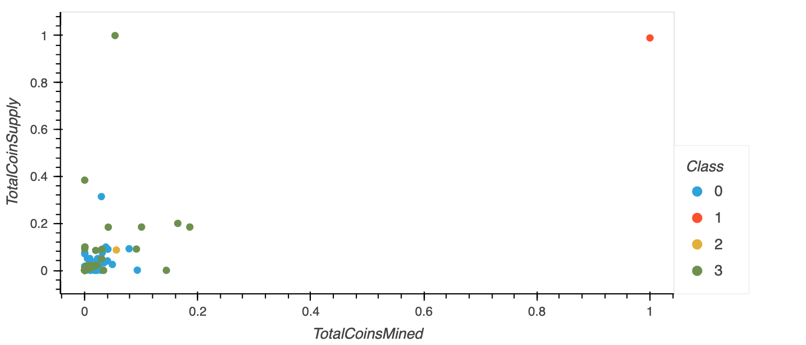

# Crypto_Currencies

## Project Overview

In this project, `Unsupervised machine learning` was used to analyze a database of cryptocurrencies and create a report of the traded cryptocurrencies which were classified in group according to their features. This type of classification analysis can be used by an invesetment bank to propose a new cryptocurrency investment portfolio to its clients. The analysis steps is as follows:

- Preprocess the database
- Reduce the data dimension using Principal Component Analysis
- Cluster cryptocurrencies using K-Means
- Visualize classification results with 2D and 3D scatter plots

## Clustering Cryptocurrencies using K-Means - Elbow Curve

## 3D-Scatter plot with clusters

## Tradable Cryptocurrencies Table

## 2D-Scatter plot with TotalCoinMined vs TotalCoinSupply

